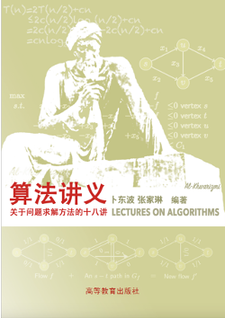

 

# UCAS Course 180086081200P1002H: Algorithm Design and Analysis -- Fall 2025

##  Course information 

asdf 

 
- **Instructor:** Dongbo Bu 
   
   - Email: dbu @ ict.ac.cn 
   
   - Office: Room 642, ICT building, Beijing 
     
- **TAs:** Yikang Huang, Konghong Tang, Rui Huang, Rui Wang, Jing Xu, Ning Qi, Hehuan Cao, Jianbo Zhou, Jiepeng Li, Xinru Zhang, Yihui Ren, Zhiyuan Wang
   
   - Email: TAGC @ ict.ac.cn 
   
   - Location: 642, ICT building, Beijing 
   
   - Office hours: 3:00-6:00, Wednesday 
   
   - Thanks to the TAs who contributed to this course during the past years:
      
       - 2024: Rui Wang, Jing Xu, Ning Qi, Hehuan Cao, Jianbo Zhou, Jiepeng Li, Tian Zhu, Xiaoyang Hou, Xinru Zhang, Yihui Ren, Yue Yu, Zhiyuan Wang
       
       - 2023: Tian Zhu, Shizhe Ding, Tiansu Gong, Xiaoyang Hou, Ruizhi Liu, Jingyan Sui, Xinru Zhang, Yihui Ren, Kun Wang, Jianquan Zhao, Yue Yu, Zhiyuan Wang
       - 2022: Milong Ren, Shizhe Ding, Tiansu Gong, Boyang Xia, Ruizhi Liu, Jingyan Sui, Xinru Zhang, Yihui Ren, Kun Wang, Jianquan Zhao, Xinglong Wang
       - 2021: Boyang Xia, Hui Wang, Jingyan Sui, Bin Huang, Xin Ku, Yu Wang, Ruizhi Liu, Shizhe Ding, Tiansu Gong, Liming Xu, Fangxiong Xiao 
       - 2020: Zeshun tan, Hui Wang, Meijie Hou, Mingai Dang, Jingyan Sui, Fusong Ju, Bin Huang, Xin Ku, Yu Wang, Lupeng Kong, Ruizhi Liu, Shizhe Ding, Tiansu Gong
       - 2019: Junchuan Dong, Zeshun Tan, Hui Wang, Meijie Hou, Mingai Dang, Zhenxin Ding, Jingyan Sui, Fusong Ju, Bin Huang, Weiyi Pan
       - 2018: Jianwei Zhu, Lupeng Kong, Fusong Ju, Guozheng Wei, Qi Zhang, Bin Huang, Hui Wang, Zhenxin Ding, Weiyi Pan, Junchuan Dong, Xinyu Hua
       - 2017: Jianwei Zhu, Lupeng Kong, Xiaoran Cao, Jingwei Zhang, Fusong Ju, Guozheng Wei, Qi Zhang
       - 2016: Jianwei Zhu, Lepeng Kong, Feng Gao, Yanbo Li, Bing Wang, Xiaoran Cao, Jingwei Zhang
       - 2015: Yaojun Wang, Jianwei Zhu, Feng Gao, Yanbo Li, Bing Wang, Hai'e Gong, Fei Yang 
       - 2014: Hai'e Gong, Fei Yang, Qing Xu, Chao Wang, Haicang Zhang, Chunlin Huang, Yaojun Wang, Renyu Zhang
       - 2013: Qing Xu, Chao Wang, Haicang Zhang, Chunlin Huang, Renyu Zhang, Yaojun Wang, Bin Ling
       - 2012: Dawei Chen, Chao Wang, Haicang Zhang, Chunlin Huang, Jin Li, Qin Huang, Lei Nie, Bin Ling
       - 2011: Chao Wang, Haicang Zhang, Mingfu Shao, Chunlin Huang, Jin Li, Qin Huang, Lei Nie
       - 2010: Mingfu Shao, Haicang Zhang, Chao Wang, Chunlin Huang 
       - 2009: Chao Wang, Mingfu Shao
   
- **Textbooks** (recommended, not required):
  - T.H. Cormen, C.E. Leiserson, R. Rivest, and C. Stein, Introduction to algorithms (2nd ed.), MIT Press, 2001. Widely available.
  - J. Kleinberg and E. Tardos, Algorithm Design. Addison-Wesley, 2005.
  - R. Motwani and P. Raghavan, Randomized Algorithms. Cambridge U. Press, 1995

- **Other reading material:**
  - Christos H. Papadimitriou, Kenneth Steiglitz, Kenneth Steiglitz. Combinatorial Optimization: Algorithms And Complexity. Courier Dover Publications, 1998
  - Ding-Zhu Du, Ker-I Ko, Xiaodong Hu. Design and analysis of approximation algorithms. Springer, 2012
  - Daming Zhu, Shaohan Ma. Algorithm design and analysis. High Education Press, 2009.
  - Udi Manber, Introduction to Algorithms: A Creative Approach.
  - M. Mitzenmacher and E. Upfal, Probability and Computer. Cambridge U. Press, 2005.
  - M. R. Garey and D. S. Johnson. Computers and Intractability: A Guide to the Theory of NP-Completeness. W.H. Freeman, New York, 1979.

- **Prerequisites:**

    We will assume knowledge of:
   - Basic data structures such as lists, trees, heaps, sorting and searching;
   - Basic discrete mathematics such as proofs by mathematical induction;
   - Computability and programming experience.

## Topics:

We will cover the following topics if time permits:
   - AI-aided algorithm design, including AlphaDev, AlphaTensor, FunSearch, and our own AIA series; 
   - Training LLM to design algorithms; 
   - Basic algorithm techniques, including greedy, iteration, divide-and-conquer, dynamic programming, network flow, linear programming;
   - Algorithm techniques for hard problems, including approximation algorithms, local search, primal-dual algorithms, linear programming;
   - Randomized algorithms: basic techniques from discrete probability, and applications to optimization;
   - Algorithm analysis techniques, including worst-case and average-case, amortized, randomization, and competitive;
   - Specific problems from computational biology and Bioinformatics (if time permits);
   - Problem hardness, NP-completeness.

## Grading policies

   4 or 5 assignments and final examination.
   
## Weekly Schedule
The week number is an active link -- each week has its own page that includes required reading, recommended reading, assignment (if any), teaching assistants, etc. Topics for weeks beyond the current and next are always tentative.

---
- **Week 1, 2, 3: Introduction to algorithm and basic design techniques**
   - **Topic 1:** Algorithm design in the era of AI
     Slides: [AI-aided algorithm design](Lectures/AIA-2024.pdf) 	
   
   - **Topic 2:** Introduction to algorithm: some representative problems
   
      Slides: [Lec1.pdf](Lectures/Lec1.pdf) 
      
   - **Topic 3:** Divide-and-conquer technique, and the combination with randomization; FFT; Matrix multiplication；Blum's algorithm for Selection problem and the improvement by G. Zeng

      Slides: [Lec5.pdf](Lectures/Lec5.pdf), [Lec5-FFT.pdf](Lectures/Lec5-FFT.pdf), [demo merge (by K. Wayne)](Lectures/Lec5-demo-merge.ppt), 
[demo of QuickSort partition (by Y. Danial Liang)](http://www.cs.armstrong.edu/liang/animation/web/QuickSortPartition.html)

   - **Reading material:**
      - Chapter 1 of Algorithm design
      - Chapter 17 of Introduction to Algorithms
      - Lecture 8, 9 of The Design and Analysis of Algorithms
      - [Faster sorting algorithms discovered using deep reinforcement learning (by Daniel J. Mankowitz, et al, 2023)](https://www.nature.com/articles/s41586-023-06004-9)
      - [Discovering faster matrix multiplication algorithms with reinforcement learning (by Alhussein Fawzi, et al, 2022)](https://www.nature.com/articles/s41586-022-05172-4)
      - [An optimal algorithm for matrix multiplication (by Changjun Jiang and Zhehui Wu, 1988)](Lectures/Lec5-MM-JiangChangjun.pdf)
      - [On the solution of linear recurrence equations (by Mohamad Akra and Louay Bazzi, 1998)](Lectures/Lec1-LinearRecurrenceEquations-Bazzi1998.pdf)
      - [Two papers on the selection problem (by BFPRT, and FR)](Lectures/Lec15-Selection-Methods-Floyd-Reviest-Blum.pdf)      
      - [College Admissions and the Stability of Marriage (by Gale and Shapley, 1962)](Lectures/Lec1-Stable-Matching-Gale-Shapley1962.pdf)
      - [STABLE ALLOCATIONS AND THE PRACTICE OF MARKET DESIGN (compiled by the Economic Sciences Prize Committee of the Royal Swedish Academy of Sciences, 2012)](http://www.nobelprize.org/nobel_prizes/economics/laureates/2012/advanced-economicsciences2012.pdf)
      - [Stable matching: Theory, evidence, and practical design (INFORMATION FOR THE PUBLIC, The Nobel prize in economic sciences, 2012)](http://www.nobelprize.org/nobel_prizes/economics/laureates/2012/popular-economicsciences2012.pdf)
      - [Who is Interested in Algorithms and Why? Lessons from the Stony Brook Algorithms Repository (by Steven S. Skiena, 1999)](Lectures/Lec1-Who-Is-Interested-in-Algorithms-Skiena1999.pdf)
      - [An Effective Heuristic Algorithm for the Traveling-Salesman Problem (by S. Lin and B. W. Kernighan, 1971)](Lectures/Lec1-TSP-Lin-Kernighan1971.pdf)
      - [Gene coexpression measures in large heterogeneous samples using count statistics (by Y. Wang, M. S. Waterman, and H. Huang, 2014)](Lectures/Lec5-Huang-Inverse-Order-PNAS2014.pdf)
      - [Duality applied to the complexity of matrix multiplications and other bilinear forms (by J. Hopcroft, and J. Musinski, 1973)](Lectures/Lec5-Matrix-Multiplication-Duality-Hopcroft1973.pdf)
      - [The Coppersmith-Winograd matrix multiplication algorithm (by M. Anderson and S. Barman, 2009)](Lectures/Lec5-Matrix-Multiplication-Coppersmith-Winograd-by-Anderson-Barman2009.pdf)
      - [Some techniques for solving recurrences  (by George S. Lueker, 1980)](Lectures/Lec5-solving-recurrence-Lueker1980.pdf)
      - [Karatsuba algorithm vs. grade-school method: experimental results (picture)](Lectures/Karastubavsgschoolv2.png)
      - [Karatsuba algorithm vs. grade-school method: experimental results (a summary)](https://introtcs.org/public/lec_01_introduction.html)
      - [Fast Division of Large Integers --- A comparison of Algorithms (by Karl Hasselstrom, 2003)](Lectures/Lec5-Fast-Division-Hasselstrom2003.pdf)
      - [Quicksort (by C. A. R. Hoare, 1962)](Lectures/Lec5-QuickSort-Hoare1962.pdf)
      - [Time bounds for selection  (by Manual Blum, Robert W. Floyd, Vaughan Pratt, Ronald Rivest, and Robert E. Tarjan, 1973)](Lectures/Lec5-Selection-Floyd-Rivest-1973.pdf)
      - [Expected time bounds for selection  (by Robert W. Floyd, Ronald L. Rivest, 1973)](Lectures/Lec5-Selection-Floyd-Rivest-1973.pdf)
      - [Ph. D. thesis of Michael Ian Shamos (Section 6.2: Closest-Point Problems)](Lectures/Lec5-Closest-Pair-ShamosThesis1978.pdf)
      - [Finding and counting given length cycles (by Noga Alon, Raphael Yuster, and Uri Zwick, 1994)](Lectures/Lec5-Counting-Cycles-in-Graph-Alon1994.pdf) 
      - [Closest Pair Data Structure: Applications (by David Eppstein)](http://www.ics.uci.edu/~eppstein/projects/pairs/Applications/)
      - [Dynamic Euclidean Minimum Spanning Trees and Extrema of Binary Functions (by David Eppstein, 1995)](Lectures/Lec5-Dynamic-Minimum-Spanning-Tree-Eppstein1995.pdf)
      - [Fast Hierarchical Clustering and Other Applications of Dynamic Closest Pairs (by David Eppstein, 1998)](Lectures/Lec5-Dynamic-Closest-Pairs-Eppstein1998.pdf)
      - [Fourier analysis (by Cleve Moler)](Lectures/Lec5-FFT-Moler2008.pdf)
      - [A general method for solving divide-and-conquer recurrences (by J. L. Bentley, D. Haken, J. B. Saxe, 1980)](Lectures/Lec5-Master-Theorem-Bentley1980.pdf)
      - [The complexity of computations (by A. A. Karatsuba, 1995)](Lectures/Lec5-Fast-Multiplication-Karatsuba1995.pdf)
      - [Sorting and selection on dynamic data (by Aris Anagnostopoulos, et al, 2011)](Lectures/Lec5-Dynamic-Sorting-and-Selection-Upfal2011.pdf)
      - [Gaussian elimination is not optimal (by V. Strassen, 1969)](Lectures/Lec5-Matrix-Multiplication-Strassen1969.pdf)
      - [Matrix multiplication via arithmetic progressions (by Don Coppersmith, Shmuel Winograd, 1990)](Lectures/Lec5-Matrix-Multiplication-Coppersmith-Winograd1990.pdf)

---
- **Week 3, 4, 5: More on basic algorithm design techniques**
   - **Topic 1:** Dynamic programming technique
   
      Slides: [Lec6.pdf](Lectures/Lec6.pdf), [Lec6-HMM.pdf](Lectures/Lec6-HMM.pdf),   [Lec6-RNA.ppt](Lectures/Lec6-RNA.ppt) 

   - **Topic 2:** Advanced dynamic programming 
   
      Slides: [Lec6.pdf](Lectures/Lec6.pdf), [Lec6-NNTSP-Feidiao2018.pptx (by Feidiao Yang)](Lectures/Lec6-NNTSP-Feidiao2018.pptx) 

   - **Reading material:**
      - Chapter 2, 15, 16, 7, 33.4 of Introduction to Algorithms
      - Chapter 5, 4, 6 of Algorithm design
      - [On Efficient Computation of Matrix Chain Products (by S. S. Godbole, 1973)](Lectures/Lec6-Matrix-Chain-Products-Godbole1973.pdf)
      - [An O(n log n) algorithm for computation of matrix chain products (by T. C. Hu and M. T. Shing, 1981)](Lectures/Lec6-Matrix-Chain-Products-Hu1981.pdf)
      - [A general method applicable to the search for similarities in the amino acid sequence of two proteins (by Saul B. Needleman, Christian D. Wunsch, 1970)](Lectures/Lec6-Sequence-Alignment-Needleman-Wunsch1970.pdf)
      - [Identification of Common Molecular Subsequences (by T.F.SMITH and M. S. WATERMAN, 1981)](Lectures/Lec6-Sequence-Alignment-Smith-Waterman1981.pdf)
      - [The statistical distribution of nucleic acid similarities (by T.F.SMITH, M. S. WATERMAN, and C. Burks, 1985)](Lectures/Lec6-Sequence-Alignment-Statistical-Distribution-of-Similarity-Smith-Waterman-Burk1985.pdf)
      - [Esitmating statistical significance of sequence similarities (by M. S. WATERMAN, 1994)](Lectures/Lec6-Sequence-Similarity-Statistical-Significance-Waterman1994.pdf)
      - [Implementation of the Smith-Waterman Algorithm on a Reconfigurable Supercomputing Platform (White paper by ALTERA, 2007)](Lectures/Lec6-Sequence-Alignment-on-FPGA-Altera2007.pdf)
      - [A linear space algorithm for computing maximal common subsequences (by D. S. Hirschberg, 1975)](Lectures/Lec6-Sequence-Alignment-Hirschberg1975.pdf)
      - [Rapid similarity searches of nucleic acid and protein data bank (by W. J. Wilbur and D. J. Lipman, 1983)](Lectures/Lec6-Rapid-DP-Lipman1983.pdf)
      - [Fast optimal alignment (by James W. Ficket, 1984)](Lectures/Lec6-Banded-DP-Fickett1984.pdf)
      - [A short note on dynamic programming in a band optimal alignment (by Jean-Francois Gilbrat, 2018)](Lectures/Lec6-Banded-DP-Gilbrat2018.pdf)
      - [Basic Local Alignment Search Tool (by S. Altschul, et al. 1990)](Lectures/Lec6-Sequence-Alignment-BLAST-Altschul1990.pdf)
      - [P-value calculation (by J. Zhang, 2007)](Lectures/Lec6-P-Value-JingZhang2007.pdf)
      - [PAM matrix for BLAST algorithm (by C. Alexander, 2002)](Lectures/Lec6-PAM-Alexander2002.pdf)
      - [On a routing problem (by Richard Bellman, 1958)](Lectures/Lec6-Shortest-Path-Bellman1958.pdf)
      - [All pair shorest path](Lectures/Lec6-All-Pair-Shortest-Path.pdf)
      - [Advanced dynamic programing](Lectures/Lec6-Advanced-DP.pdf)
      - [Richard Bellman on the birth of dynamic programming (by Stuart Dreyfus, 2002)](Lectures/Lec6-Shortest-Path-BirthOfDP-Dreyfus.pdf)
      - [Algorithms for Knapsack problem (Ph. D. thesis of David Pisinger, 1995)](Lectures/Pisinger1995.pdf)
      - [Computing Partitions with Applications to the Knapsack problem (by E. Horowitz and S. Sahni, 1974)](Lectures/Lec6-Knapsack-Horowitz1974.pdf)
      - [The rise and fall of Knapsack cryptosystems (by A. M. Olyzko, 1994)](Lectures/Lec6-Knapsack-Cryptosystem-Olyzko1994.pdf)
      - [A dynamic programming approach to sequencing problems (by Michael Held and Richard M. Karp, 1962)](Lectures/Lec6-TSP-Held-Karp1962.pdf)
      - [Knapsack problems (by Hans Kellerer, Ulrich Pferschy, and David Pisinger, 2003)](Lectures/Lec6-Knapsack-Problems-Kellerer2003.pdf)
      - [Publick-key cryptosystem (by Charles Clancy)](Lectures/Lec6-Knapsack-Public-Key-Cryptography-Clancy.pdf)

---
- **Week 5, 6, 7: Still more on basic algorithm design techniques**
   - **Topic 1:** Greedy technique
   
      Slides: [Lec7.pdf](Lectures/Lec7.pdf), [demo of Dijkstra's algorithm](Lectures/Lec7-demo-Dijkstra.pdf), [demo of Interval Scheduling algorithm (by Kevin Wayne)](Lectures/Lec7-demo-intervalscheduling.ppt), [Lec7-Heap.pdf](Lectures/Lec7-Heap.pdf), [Lec7-UnionFind.pdf](Lectures/Lec7-UnionFind.pdf), [FibonacciHeaps.pdf (by Kevin Wayne)]([Lectures/Lec1.pdf](http://www.cs.princeton.edu/~wayne/kleinberg-tardos/pdf/BinomialHeaps.pdf)), [BinomialHeaps.pdf (by Kevin Wayne)]([Lectures/Lec1.pdf](http://www.cs.princeton.edu/~wayne/kleinberg-tardos/pdf/FibonacciHeaps.pdf)), [FibonacciHeaps.pdf (by Kevin Wayne)]([Lectures/Lec1.pdf](http://www.cs.princeton.edu/~wayne/kleinberg-tardos/pdf/FibonacciHeaps.pdf)), [DemoBinaryHeap.pdf (by Kevin Wayne)]([Lectures/Lec1.pdf](http://www.cs.princeton.edu/~wayne/kleinberg-tardos/pdf/FibonacciHeaps.pdf)), [DemoHeapify.pdf (by Kevin Wayne)]([Lectures/Lec1.pdf](http://www.cs.princeton.edu/~wayne/kleinberg-tardos/pdf/FibonacciHeaps.pdf))
      
   - **Topic 2:** Basic algorithm analysis techniques, worst-case, average-case, and amortized analysis
  
      Slides: [Lec2.pdf](Lectures/Lec2.pdf), [demo of TableInsert (by C. Leiserson)](Lectures/demo-tableinsert.pdf)  

   - **Reading material:**
      - Chapter 2, 15, 16, 7, 33.4 of Introduction to Algorithms of Algorithm design,
      - Chapter 4, 5, 6 of Introduction to Algorithms,
      - [a note by Sleator](http://www.cs.cmu.edu/afs/cs.cmu.edu/academic/class/15859-f09/www/handouts/fibonacci-heaps.txt)
      - [A note on two problems in connexion with graphs (by E. W. Dijkstra, 1959)](Lectures/Dijkstra1959.pdf)
      - [Algorithm 97: Shortest path (by Robert W. Floyd, 1962)](Lectures/Floyd1962.pdf)
      - [Top-down analysis of path compression (by Raimund Seidel and Micha Sharir, 2005)](Lectures/Seidel2005.pdf)
      - [Set merging algorithms (by Hopcroft J. E., Ullman J. D., 1973)](Lectures/Union-Find-Hopcroft.pdf)
      - [Efficiency of equivalence algorithms (by M. Fischer, 1972)](Lectures/Union-Find-Fischer.pdf)
      - [Efficiency of a good but not linear set union algorithm (by R. Tarjan, 1975)](Lectures/Union-Find-Tarjan1975.pdf)
      - [Worst-case analysis of set union algoritms (by R. Tarjan, 1984)](Lectures/Union-Find-Tarjan1984.pdf)
      - [A theorem on Boolean matrics (by Stephen Warshall, 1962)](Lectures/Warshall1962.pdf)
      - [Efficient algorithms for shortest paths in sparse networks (by Donald B. Johnson, 1977)](http://dl.acm.org/citation.cfm?doid=321992.321993)
      - [Disjoint paths in networks (by J. W. Suurballe, 1974)](http://onlinelibrary.wiley.com/doi/10.1002/net.3230040204/abstract)
      - [An interview with Edsger W. Dijkstra (Conducted by Philip L. Frana 2001)](http://conservancy.umn.edu/bitstream/107247/1/oh330ewd.pdf)
      - [On the shortest spanning subtree of a graph and the traveling salesman problem (by Joseph B. Kruskal Jr., 1955)](Lectures/Kruskal1955.pdf)
      - [Shortest Connection Networks and Some Generalizations  (by Robert. C. Prim, 1957)](Lectures/Prim1957.pdf)
      - [A Mathematical Theory of Communication (by C. E. Shannon, 1948)](Lectures/Shannon1948.pdf)
      - [An interview with Claude Shannon (Conducted by Robert Price, 1982)](http://www.ieeeghn.org/wiki/index.php/Oral-History:Claude_E._Shannon)
      - [An interview with Robert M. Fano (Conducted by Arthur L. Norberg, 1989)](Lectures/InterviewFano.pdf)
      - [A Method for the Construction of Minimum-Redundancy Codes (by DAVID A. HUFFMAN, 1952)](Lectures/Huffman1952.pdf)
      - [Profile: David A. Huffman Encoding the “Neatness” of Ones and Zeroes (by Gary Stix, 1991)](http://www.huffmancoding.com/my-uncle/scientific-american)
      - [Binary Essence: Various aspects of data compression](http://www.binaryessence.com/index.html)
      - [Algorithm 245, TreeSort 3 (by Robert M. Floyd, 1964)](Lectures/FloydHeap1964.pdf)
      - [Discovery of Huffman Codes (by Inna Pivkina, 2010)](Lectures/DiscoveryHuffman.pdf)
      - [Binomial Heap Script (by Sotirios Stergiopoulos, 2001)](http://www.cse.yorku.ca/~aaw/Sotirios/BinomialHeap.html)
      - [Fibonacci Heap Animation (by Jason Huang Hu and Wei Wang, 2003)](http://www.cse.yorku.ca/~aaw/Jason/FibonacciHeapAnimation.html)
      - [What is a matroid?  (by James Oxley, 2003)](Lectures/Oxley2003.pdf)
      - [On the abstract properties of linear dependence (by Hassler Whitney, 1935)](Lectures/Whitney1935.pdf)
      - [Non-separable and planar graphs (by Hassler Whitney, 1932)](Lectures/Whitney1932.pdf)
      - [Matroids and greedy algorithms(by Jack Edmonds, 1971)](Lectures/Edmonds1971.pdf)
      - [A Data Structure for Manipulating Priority Queues (by Jean Vuillemin, 1978)](Lectures/Binomial-Heap-Vuillemin.pdf)
      - [Fibonacci heaps and their uses in improved network optimization algorithms (by M. Fredman and R. Tarjan, 1987)](Lectures/Fibonacci-Heap-Tarjan.pdf)
      - [Robert Tarjan --- the art of the algorihtms  (by Jamie Beckett, 2004)](http://www.hpl.hp.com/news/2004/oct_dec/tarjan.html)
      - [Amortized Analysis Explained (by Rebecca Fiebrink)](http://www.cs.princeton.edu/~fiebrink/423/AmortizedAnalysisExplained_Fiebrink.pdf)

---
- **Week 8, 9: Linear programming**
   - **Topic 1:** Linear programming and simplex algorithm 
   
      Slides: [Lec8.pdf](Lectures/Lec8.pdf),  [Lec8-Secretary-Problem.pdf](Lectures/Lec8-Secretary-Problem.pdf), [Lec8.pdf](Lectures/Lec8.pdf), [Lec8-Genome-Rearrange-Problem.pdf](Lectures/Lec8-Genome-Rearrange-Problem.pdf), [an example of cycling in simplex algorithm (given by E. M. L. Beale, 1955)](Lectures/Lec8-simplex-cycling.pdf),  [the DIET problem (in.math format) ](Lectures/Lec8-DIET.math)

      
   - **Topic 2:** Klee-Minty cube and smoothed complexity
   
      Slides: [an example of Klee-Minty cube](Lectures/Lec8-Klee-Minty-gnuplot.sh),  [a script to generate Klee-Minty cube (with noise)](Lectures/Lec8-Generate-Klee-Minty-1M-withnoise.py), [a script to generate Klee-Minty cube (without noise)](Lectures/Lec8-Generate-Klee-Minty-1M.py)            
   - **Reading material:**
      - Chapter 29 of Introduction to Algorithms, Combinatorial optimization: algorithm and complexity
      - [An interview with George B. Dantzig: the farther of linear programming (Conducted by Watts, Griffis and McOuat, 1986)](http://www.phpsimplex.com/en/Dantzig_interview.htm)
      - [Mathematical Methods of Organizing and Planning Production (by L. Kantorovich, 1939)](Lectures/Kantorovich1939.pdf)
      - [The First Algorithm for Linear Programming: An Analysis of Kantorovich's Method (by C. van de Panne and F. Rahnama, 1985)](Lectures/TheFirstAlgorithmForLP.pdf)
      - [CONCEPTS OF OPTIMALITY AND THEIR USES (Nobel memorial lecture, by T. Koopmans, 1975)](Lectures/Koopmans1975.pdf)
      - [Mathematics in Economics: Achievements, Difficulties, Perspectives (Nobel memorial lecture, by L. Kantorovich, 1975)](http://www.nobelprize.org/nobel_prizes/economic-sciences/laureates/1975/kantorovich-lecture.html)
      - [The diet problem (by George B. Dantzig, 1990)](Lectures/Dantzig1990.pdf)
      - [A primal-dual algorithm (by George B. Dantzig, L. R. Ford, D. R. Fulkerson 1956)](Lectures/Primal-Dual1956.pdf)
      - [The cost of subsistence  (by George Stigler, 1945)](Lectures/Stigler-DIET1945.pdf)
      - [Linear programming (by George B. Dantzig, 2002)](Lectures/Dantzig2002.pdf)
      - [Linear programming and extensions PART I (by George B. Dantzig, 1963)](Lectures/Dantzig1963-1.pdf)
      - [Linear programming and extensions PART II (by George B. Dantzig, 1963)](Lectures/Dantzig1963-2.pdf)
      - [Ellipsoid Method (by Steffen Rebennack, 2008)](Lectures/EllipsoidMethod.pdf)
      - [Lecture notes on the ellipsoid algorithm (by Michel Goemans, 2009)](http://www-math.mit.edu/~goemans/18433S09/ellipsoid.pdf)
      - [The Ellipsoid Method: A Surve](Lectures/ellipsoid-survey.pdf)
      - [Primal-Dual methods for linear programming (by Philip E. GILL, Walter MURRAY, Dulce B. PONCELEON and Michael A. SAUNDERS, 1994)](Lectures/Primal-Dual-Interior-Point.pdf)
      - [Interior point methods and linear programming (by Robert Robere, 2012)](Lectures/Interior-Point-and-LP.pdf)
      - [ON PROJECTED NEWTON BARRIER METHODS FOR LINEAR PROGRAMMING AND AN EQUIVALENCE TO KARMARKAR'S PROJECTIVE METHOD (by Philip E. Gill, Walter MURRAY, Michael A. SAUNDERS, J.A. TOMLIN, Margaret H. WRIGHT, 1986)](Lectures/GMS1986.pdf)
      - [A new polynomial-time algorithm for linear programming (by N. Karmarkar, 1984)](http://download.springer.com/static/pdf/719/art%253A10.1007%252FBF02579150.pdf?auth66=1416910246_6682e1c321afe9718062076a70b422f2&ext=.pdf)
      - [C++ implementation of Khachiya algorithm for the minimum enclosing (or covering) ellipsoid (by Bojan Nikolic)](http://www.bnikolic.co.uk/blog/cpp-khachiyan-min-cov-ellipsoid.html)
      - [In memoriam: Leonid Khachiyan](http://www.cs.rutgers.edu/Khachiyan/)
      - [Klee-Minty example (by H. Greenberg)](Lectures/Lec8-Klee-Minty.pdf)
      - [Simplex examples](http://math.uww.edu/~mcfarlat/s-prob.htm)
      - [Smoothed complexity (by D. Spielman and S. Teng)](Lectures/Lec8-smoothedcomplexity.pdf)
      - [Smoothed Analysis of Algorithms: Why the Simplex Algorithm Usually Takes Polynomial Time (by D. Spielman and S. Teng, 2001)](http://arxiv.org/abs/cs/0111050)
      - [GLPK (GNU Linear Programming Kit](http://www.gnu.org/s/glpk/)
      - [A new polynomial-time algorithm for linear programming (by N. Karmarkar, 1984)](Lectures/Karmarkar1984.pdf)
      - [The interior-point revolution in optimization: history, recent developments, and lasting consequences (by Margaret H. Wright, 2004)](Lectures/Wright2004.pdf)
      - [Why a pure primal Newton barrier step may be infeasible? (by Margaret H. Wright, 1995)](Lectures/Why-a-pure-primal-newton-barrier-step-may-be-infeasible.pdf)
      - [Numerical Optimization (by Nocedal, Jorge, Wright, S., 2006)](http://www.springer.com/us/book/9780387303031)
      - [Solving Inequalities and Proving Farkas’s Lemma Made Easy (by David Avis and Bohdan Kaluzny)](Lectures/Avis.pdf)

---
- **Week 10, 11: Linear programming and duality**
   - **Topic 1:** Lagrangian duality, Lagrange multiplier method and KKT conditions 
   - **Topic 2:** Interior point algorithm, transform a quadratic linear programing into two-step dynamic programing
   
      Slides: [Lec9.pdf](Lectures/Lec9.pdf),  [a gnuplot script to illustrate Lagrangian dual](Lectures/Lec9-Lagrangian-dual.gnuplot.script),  [Lec9-DIET.math](Lectures/Lec9-DIET.math),  [Lec9-DIET-Dual.math](Lectures/Lec9-DIET-Dual.math),  [Lec9-DIET-b1-2001.math](Lectures/Lec9-DIET-b1-2001.math),  [Lec9-DIET-b2-56.math](Lectures/Lec9-DIET-b2-56.math),  [Lec9-DIET-b3-801.math](Lectures/Lec9-DIET-b3-801.math)
   
      
   - **Reading material:**
      - Chapter 29 of Introduction to Algorithms
      - Combinatorial optimization: algorithm and complexity
      - [On the theory of games of strategy (by John von Neumann, 1928)](https://books.google.com/books?hl=en&lr=&id=9lSVFzsTGWsC&oi=fnd&pg=PA13#v=onepage&q&f=false)
      - [Non-Cooperative Games (by John Nash, 1951)](http://www.cs.uu.nl/docs/vakken/msagi/Nash51.pdf)
      - [Zero-sum Two-person Games (by T. E. S. Raghavan, 1994)](https://link.springer.com/referenceworkentry/10.1007%2F978-1-4614-1800-9_209#page-1)
      - [KKT Examples (by Stanley B. Gershwin)](Lectures/KKT-examples.pdf)
      - [KKT conditions and applications  (by Michel Baes)](Lectures/KKT-applications.pdf)
      - [Duality and KKT conditions (by S. Cui)](Lectures/Duality-and-KKT.pdf)
      - [Lagrangian Multipliers Revisited (by Morten Slater, 1950)](Lectures/Lec9-Slater1950.pdf)
      - [The Lagrangian Relaxation Method for Solving Integer Programming Problems (by Marshall Fisher, 2004)](Lectures/LagrangeRelaxationFisher.pdf)
      - [Lagrange relaxation and KKT conditions ()](http://www2.math.uu.se/fmb/courseinfo_opt/Lagrange.pdf)
      - [Applied integer programming --- modelling and solution](http://ishare.iask.sina.com.cn/f/22280903.html?from=like)

---
- **Week 12, 13: Network flow algorithm**
   - **Topic: 1** Network flow and its applications

      Slides: [Lec10.pdf](Lectures/Lec10.pdf),  [Applications of network flow](Lectures/Lec10-Applications.pdf) 
   
   - **Topic: 2**   Ford-Fulkerson algorithm, Scaling technique, Edmonds-Karp algorithm, Dinic's algorithm, push-relabel algorithm and recent progress 
  
      Slides: [demo of Ford-Fulkerson algorithm](Lectures/Lec10-demo-FF.ppt),  [irrational capacities might lead to endless iterations](Lectures/Lec10-demo-Irrational-Capacity.ppt),  [multiple optimal solutions](Lectures/Lec10-demo-FF-multiple-solution.ppt), [demo of Edmonds-Karp algorithm ](Lectures/Lec10-demo-Edmonds-Karp.ppt),  [demo of Dinic's algorithm](Lectures/Lec10-demo-Dinic.ppt)
   
  - **Reading material:**
      - Chapter 26 of Algorithm design,
      - Chapter 7 of Algorithm design, Combinatorial optimization: algorithm and complexity
      - [Network-flow research history (by A. Schrijver)](Lectures/Lec10-history-networkflow.pdf)
      - [Maximal flow through a network (by L. R. Ford Jr. and D. R. Fulkerson, 1956)](Lectures/FordFulkerson1956.pdf)
      - [Efficient Maximum Flow Algorithms (by Andrew V. Goldberg, and Robert Tarjan, 2014)](Lectures/Lec10-MaxFlow-Efficient-Algorihtms-Goldberg2014.pdf)
      - [The exact time bound for a maximum flow algorithm applied to a set of representative problems (by A. Karzanov, 1973)](Lectures/Lec10-MaxFlow-Karzanov1973.pdf)
      - [Determining the maximal flow in a network by the method of preflows (by A. Karzanov, 1974)](Lectures/Lec10-MaxFlow-Karzanov1974.pdf)
      - [Determinining the maximal flow in a network by the method of preflows (by A. Karzanov, 1974)](https://www.researchgate.net/publication/230837862_Determining_the_maximal_flow_in_a_network_by_the_method_of_preflows)
      - [Algorithm for solution of a problem of maximum flow in a network with power estimation (by E. A. Dinic, 1970)](Lectures/Dinic1970.pdf)
      - [Finding minimum-cost flows by double scaling (by R. A. Ahuja, A. V. Goldberg, J. B. Orlin, and R. E. Tarjan, 1992)](Lectures/Lec10-MaxFlow-Scaling-MinCostFlow-Ahuja1992.pdf)
      - [Dinitz' Algorithm: The Original Version and Even's Version (by Yefim Dinitz, 2006)](Lectures/Dinitz2006.pdf)
      - [Finding disjoint paths in networks (by D. Sidhu, R. Nair, and S. Abdallsh, 1991)](http://dl.acm.org/citation.cfm?id=115998)
      - [Theoretical Improvements in Algorithmic Efficiency for Network Flow Problems (by Jack Edmonds and Richard M. Karp, 1972)](Lectures/EdmondsKarp1972.pdf)
      - [Network Flow Algorithms (Andrew V.Goldberg, Eva Tardos and Robert E. Tarjan, 1990)](Lectures/GoldbergTardosTarjan1990.pdf)
      - [Maximum Matching and a Polyhedron With O,1-Vertices1 Jack Edmonds (by Jack Edmonds, 1964)](Lectures/Edmonds1964.pdf)
      - [Paths, Trees and Flowers](Lectures/PathsTreesAndFlowers.pdf)
      - [Paths, Trees and Flowers (by Jack Edmonds, 1965)](Lectures/Edmonds1965.pdf)
      - [Faster scaling algorithms for general graph matching problems (by H. N. Gabow, R. Tarjan, 1991)](Lectures/Lec10-Maximum-Weighted-Matching-Scaling2.pdf)
      - [A Scaling Algorithm for Maximum Weight Matching in Bipartite Graphs (by Ran Duan, Hsin-Hao Su, 2012)](Lectures/Lec10-Maximum-Weighted-Matching-Scaling.pdf)
      - [Efficient Algorithms for Finding Maximal Matching in Graphs (by Zvi Galil, 1983)](Lectures/Lec10-Maximum-Weighted-Matching-Zvi.pdf)
      - [Linear-Time Approximation for Maximum Weight Matching(by Ran Duan, Seth Pettie, 2014)](Lectures/Lec10-Maximum-Weighted-Matching-Approaximation.pdf)
      - [Max-Product for Maximum Weight Matching: Convergence, Correctness, and LP Duality (by Mohsen Bayati, Devavrat Shah, and Mayank Sharma, 2008)](Lectures/Lec10-Maximum-Weighted-Matching-Duality.pdf)
      - [A Primal Method for Minimal Cost Flows with Applications to the Assignment and Transportation Problems (by Morton Klein, 1967)](Lectures/Klein1967.pdf)
      - [Max flows in O(nm) time, or better (by James Orlin, 2012)](Lectures/Orlin2012.pdf)
      - [Trees: A Mathematical Tool for All Seasons, including History of algorithms to find minimum cost spanning trees (by Joe Malkevitch)](http://www.ams.org/samplings/feature-column/fcarc-trees)
      - [50 Years of Integer Programming 1958-2008: From the Early Years to the State-of-the-Art, Springer, 2010 (Edited by M. Juenger, T. M. Kiebling, D. Naddef, G. L. Nemhauser, W. R. Pulleyblank, G. Reinelt, G. Rinaldi, and L. A. Wolsey)](http://www.amazon.com/Years-Integer-Programming-1958-2008-State/dp/3540682740)
      - [Finding minimum-cost circulations by successive approximation ( by Andrew V. Goldberg, Robert E. Tarjan, 1987)](Lectures/GoldbergTarjan1987.pdf)
      - [What energy functions can be minimized via graph cuts (by  Vladimir Kolmogorov, Ramin Zabih, 2004)](Lectures/Kolomogorov2004.pdf)
      - [Polyhedral Combinatorics and Combinatorial Optimization (by Alexander Schrijver)](Lectures/Lec10-Polyhedrals-AlexanderSchrijver.pdf)
      - [Two theorems in graph theory (by Clauder Berge, 1957)](Lectures/Berge1957.pdf)
      - [An $n^{5/2}$ Algorithm for Maximum Matchings in Bipartite Graphs (by J. Hopcroft, and R. Karp, 1973)](Lectures/HopcroftKarp1973.pdf)
      - [On representatives of subsets (by P. Hall, 1935)](Lectures/Hall1935.pdf)
      - [A Primal Method for the Assignment and Transportation Problems (by M. L. Balinski and R. E. Gomory, 1964)](Lectures/Lec10-Matching-Primal-Method.pdf)
      - [The Hungarian Method for the Assignment Problem (by H. W. Kuhn, 1955)](Lectures/Lec10-HungarianMethod-Kuhn.pdf)
      - [Variants of The Hungarian Method for  Assignment Problems (by H. W. Kuhn, 1956)](Lectures/Lec10-Matching-HungarianMethod-Variants.pdf)
      - [On the history of combinatorial optimization (by Alexander Schrijver, 2005)](Lectures/Lec10-Matching-history-of-CO-till1960.pdf)
      - [Jen¨o Egerv´ary: from the origins of the Hungarian algorithm to satellite communication (by Silvano Martello, 2009)](Lectures/Lec10-Matching-from-the-origin.pdf)
      - [On combinatorial properties of matrices (by Jeo Egervary, 1931, Translated by H. Kuhn)](Lectures/Lec10-Matching-Egervary-Eng.pdf)
      - [Solutions of games by differential equations (by G. W. Brown, von Neumann, In: H. W. Kuhn and A. W. Tucker, Eds., Contributions to the Theory of Games I, Princeton University Press, Princeton, 1950)](Lectures/Lec10-Matching-vonNeumann1.pdf)
      - [A certain zero-sum two-person game equivalent to the optimal assignment problem (by von Neumann, In: H. W. Kuhn and A. W. Tucker, Eds., Contributions to the Theory of Games I, Princeton University Press, Princeton, 1950)](Lectures/Lec10-Matching-vonNeumann2.pdf)
      - [Algorithms for the assignment and transportation problems (by James Munkres, 1957)](Lectures/Munkres1957.pdf)
      - [A bibliography of graph matching (by Seth Pettie)](http://web.eecs.umich.edu/~pettie/matching/)
      - [Differential gene expression analysis using coexpression and RNA-Seq data (by Tao Jiang et al. 2013)](Lectures/JiangTao2013.pdf)

---
- **Week 14, 15, 16: Problem intrinsic property: Hardness**
   - **Topic 1:** Computability and Turing machine 
   
      Slides: [demo of Turing machine (by Zhen Ji)](http://202.116.45.236/uploads/soft/duomeiti/flash/5/images/5.swf),  [demo of Turing machine (by Andrew Hodges)](http://www.turing.org.uk/turing/scrapbook/tmjava.html), [Turing machine (by Kevin Wayne)](Lectures/Lec4-TuringMachine.pdf), [Computability (by Kevin Wayne)](Lectures/Lec4-Computability.pdf)
   
   - **Topic 2:** Problem hardness and polynomial-time reduction
   
      Slides: [Lec3.pdf](Lectures/Lec3.pdf) 
      
    - **Topic 3:** NP-Hard problems: packing problem, covering problem, sequencing problem, partitioning, coloring, SAT, numbering problems, etc.
   
      Slides: [Lec4.pdf](Lectures/Lec4.pdf), [2SAT is in P ((by D. Moshko)](Lectures/Lec4-2SAT.ppt) 
           
   - **Reading material:**
      - Computer and intractability
      - Chapter 34 of Introduction to Algorithms,
      - Chapter 8 of Algorithm design
      - [Reducibility among combinatorial problems (by R. M. Karp, 1972)](Lectures/Karp1972.pdf)
      - [Molecular Computation of Solutions to Combinatorial Problems (by Leonard M. Adleman, 1994)](Lectures/Adleman1994.pdf)
      - [Computing with DNA (by Leonard M. Adleman, 1998)](Lectures/Adleman1998.pdf)
      - [Computer in a testtube (by Hendrik Jan Hoogeboom, 2010)](Lectures/ComputerInATestTube.pdf)
      - [How to apply de Bruijn graphs to genome assemly (by Phillip E. C. Compeau, Pavel A. Pevzner, and Glenn Tesler, 2011)](Lectures/Pavel2011.pdf)
      - [The complexity of theorem-proving procedures (by Stephen A. Cook, 1971)](http://4mhz.de/cook.html)
      - [The P versus NP problem (by Stephen Cook)](Lectures/PNP.pdf)
      - [A compendium of NP optimization problems (Edited by Pierluigi Crescenzi, Viggo Kann, M. Halldorsson, M. Karpinski, and G. Woeinger)](http://www.csc.kth.se/%7Eviggo/wwwcompendium/)

---
- **Week 17, 18, 19: Solving hard problems: approximation, randomization, special cases and heuristics**
   - **Topic 1:** Approximation algorithm: a brief introduction
   
      Slides: [Lec11.pdf](Lectures/Lec11.pdf), [Parametric pruning algorithm for k-center problem (by P. Potikas)](Lectures/Lec11-k-center.pdf), [Lec11-SetCover-Primal.math](Lectures/Lec11-SetCover-Primal.math), [Lec11-SetCover-Dual.math](Lectures/Lec11-SetCover-Dual.math), [Lec11-MakeSpan.math](Lectures/Lec11-MakeSpan.math)   
      
   - **Topic 2:** Randomized algorithm: a brief introduction
   
      Slides: [Lec12.pdf](Lectures/Lec12.pdf), [Hashing (by Kevin Wayne)](Lectures/Lec12-Hashing.ppt) 
      
   - **Topic 3:** Extending limits of tractability 
   
      Slides: [Lec13.pdf](Lectures/Lec13.pdf)
      
   - **Topic 3:** Heuristics, including lcoal search and simulated annealing 
   
      Slides: [Local Search (by K. Wayne)](Lectures/Lec14-local-search-all.ppt)            
      
   - **Reading material:**
      - Chapter 10, 11, 13 of Algorithm design,
      - Chapter 35 of Introduction to Algorithms,
      - Combinatorial optimization: algorithm and complexity
      - Randomized Algorithm (by R. Motwani and P. Raghavan)
      - Approximation algorithm (by V. Vazirani)
      - [Branch and bound algorithms --- priciples and examples (by Jens Clausen, 1999)](Lectures/Branch-and-bound-algorithms.pdf)
      - [Parameterized complexity and approximation algorithms (by Daniel Marx, 2005)](Lectures/Lec12-Parameterized-Complexity-and-Approximation-Algorithm.pdf)
      - [CS266 -- Parameterized Algorithms and Complexity (by Ryan Williams, 2013)](http://www.stanford.edu/~rrwill/cs266.html)
      - [Invitation to parameterized algorithms (by Rolf Niedermeier, 2002)](http://citeseerx.ist.psu.edu/viewdoc/download?doi=10.1.1.94.4638&rep=rep1&type=pdf)
      - [Randomized algorithms (by P. Raghavan)](Lectures/Raghavan.pdf)
      - [Global Min-cuts in RNC, and other ramifications of a simple min-cut algorithm (by David R. Karger, 1992)](Lectures/Karger1992.ps)
      - [TreePack: rapid side-chain prediction using tree-decomposition](Lectures/XuJinbo2005.ppt)
      - [Rapid side-chain prediction via tree decomposition (by Jinbo Xu, 2005)](Lectures/XuJinbo2005.pdf)
      - [Protein Threading using PROSPECT: Design and Evaluation (by Ying Xu and Dong Xu, 2000)](Lectures/XuYing2000.pdf)

---
- **Week 20, 21, 22: Some interesting problems and algorithms**
   - **Topic 1:**  Cache paging problem: FF, LRU, and randomized algo
      
      Slides: [Lec16.pdf](Lectures/Lec16.pdf) 
      
   - **Topic 2:**  String matching problem: DFA, KMP method, randomized finger-print, and Karp-Rabin algorithm
      
      Slides: [Lec17.pdf](Lectures/Lec17.pdf) 
  
    - **Topic 3:** Closest string and substring problems: random rounding and random sampling
      
      Slides: [Lec18.pdf](Lectures/Lec18.pdf)  
      
    - **Topic 4:** Bi-Clustering problem: random rounding, a new random sampling idea
      
      Slides: [Lec19.pdf](Lectures/Lec19.pdf)  
      
    - **Topic 5:** MaxCut problem: Hardness, Local search algorithm, randomization algorithm, derandomization, and SDP approach;
       
      Slides: [Lec20.pdf](Lectures/Lec20.pdf)       
 
      
   - **Reading material:**
      - Lectures by D. P. Williamson
      - [Semidefinite programming (by LIEVEN VANDENBERGHEt AND STEPHEN BOYD, 1996)](Lectures/SDP_Folyd_1996.pdf)
      - [Introduction to semidefinite programmin (by R. Freund)](Lectures/SDPFreund.pdf)

---
The course is supported by [Loongson CPU](https://www.loongson.cn/)  

In memory of my student, [Prof. Yu Lin](https://cecs.anu.edu.au/people/yu-lin), who is an excellent computer scientist and has great contribution to this course
